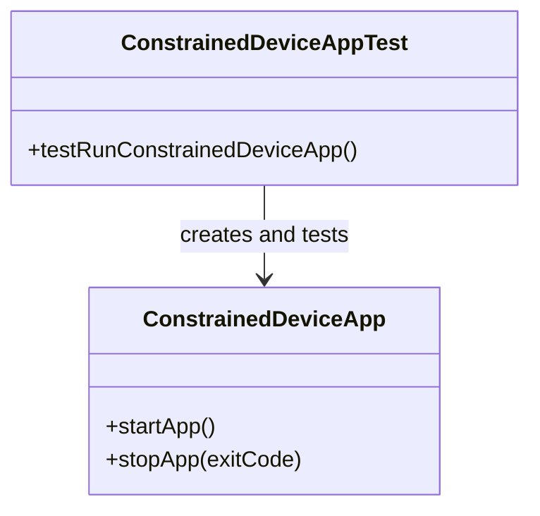

## Lab Module 01

### Description

The Constrained Device Application (CDA) provides the Python-based edge-device portion of the Programming the Internet of Things system. For this lab, I configured the CDA development environment in WSL2 using Ubuntu 22.04 and Python 3.10.12. I created a Python virtual environment, installed the required packages, and configured PYTHONPATH. The application successfully initializes, starts, and stops with exit code 0.

The implementation works through the ConstrainedDeviceApp class, which controls the application lifecycle. Its startApp() method starts the application, while stopApp() performs an orderly shutdown. I validated this behavior using ConstrainedDeviceAppTest. The test constructs the application, starts it, and stops it successfully.

### Code Repository and Branch

URL: https://github.com/akinmide/cda-python-components/tree/labmodule01

### UML Design Diagram(s)

### Unit Tests Executed

- No Lab Module 01-specific unit tests were required.

### Integration Tests Executed

- Test case: ConstrainedDeviceAppTest
- Test method: testRunConstrainedDeviceApp
- Command: python -m unittest tests.integration.app.test_ConstrainedDeviceApp -v
- Result: One test executed successfully (OK). The CDA initialized, started, and stopped with exit code 0.
