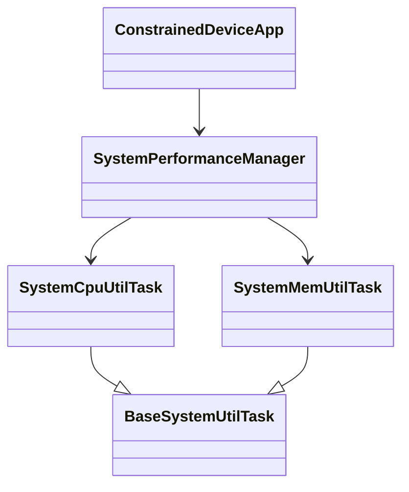

# Constrained Device Application (Connected Devices)

## Lab Module 02

Be sure to implement all the PIOT-CDA-* issues (requirements) listed at [PIOT-INF-02-001 - Lab Module 02](https://github.com/orgs/programming-the-iot/projects/1#column-9974938).

### Description

The CDA implementation adds scheduled system-performance monitoring to the constrained device application. It collects CPU and memory utilization through specialized tasks, identifies each task using the configured name and type ID, and logs the resulting telemetry at the configured polling interval.

The implementation uses `BaseSystemUtilTask` as the common abstraction for system-utilization tasks. `SystemCpuUtilTask` and `SystemMemUtilTask` retrieve measurements through `psutil`, while `SystemPerformanceManager` schedules collection with APScheduler. `ConstrainedDeviceApp` creates the manager and starts or stops it with the application lifecycle.

### Code Repository and Branch

URL: https://github.com/akinmide/cda-python-components/tree/labmodule02

### UML Design Diagram(s)

### Unit Tests Executed

- `tests.unit.system.test_SystemCpuUtilTask.SystemCpuUtilTaskTest.testGetTelemetryValue`
- `tests.unit.system.test_SystemMemUtilTask.SystemMemUtilTaskTest.testGetTelemetryValue`

### Integration Tests Executed

- `tests.integration.system.test_SystemPerformanceManager.SystemPerformanceManagerTest.testStartAndStopManager`
- `tests.integration.app.test_ConstrainedDeviceApp.ConstrainedDeviceAppTest.testRunConstrainedDeviceApp`

EOF.
