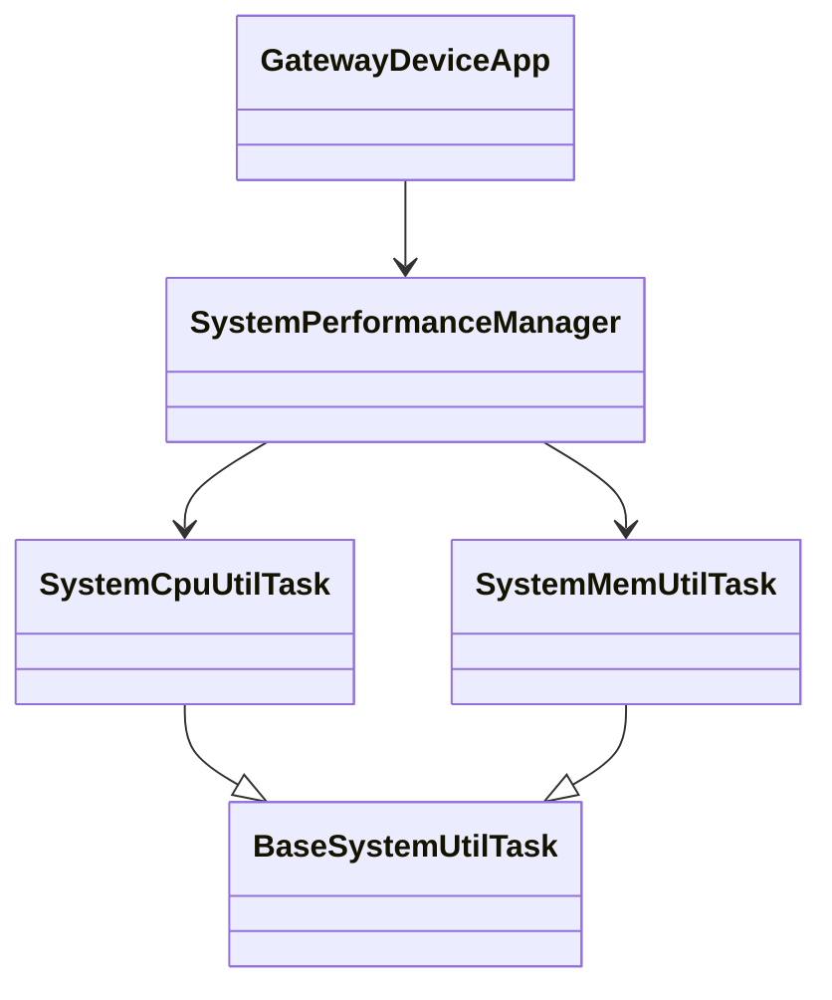

# Gateway Device Application (Connected Devices)

## Lab Module 02

Be sure to implement all the PIOT-GDA-* issues (requirements) listed at [PIOT-INF-02-001 - Lab Module 02](https://github.com/orgs/programming-the-iot/projects/1#column-9974938).

### Description

The GDA implementation adds scheduled system-performance monitoring to the gateway device application. It collects system load and JVM heap-memory utilization through specialized Java tasks, identifies each task using its configured name and type ID, and logs the measurements at the configured polling interval.

The implementation uses the abstract `BaseSystemUtilTask` class as the common contract. `SystemCpuUtilTask` and `SystemMemUtilTask` obtain values through Java management APIs, while `SystemPerformanceManager` uses `ScheduledExecutorService` for periodic execution. `GatewayDeviceApp` creates the manager and controls it through the application start and stop lifecycle.

### Code Repository and Branch

URL: https://github.com/akinmide/gda-java-components/tree/labmodule02

### UML Design Diagram(s)

### Unit Tests Executed

- `programmingtheiot.unit.system.SystemCpuUtilTaskTest.testGetTelemetryValue`
- `programmingtheiot.unit.system.SystemMemUtilTaskTest.testGetTelemetryValue`

### Integration Tests Executed

- `programmingtheiot.integration.system.SystemPerformanceManagerTest.testStartAndStopManager`
- `programmingtheiot.integration.app.GatewayDeviceAppTest.testStartAndStopGatewayApp`

EOF.
